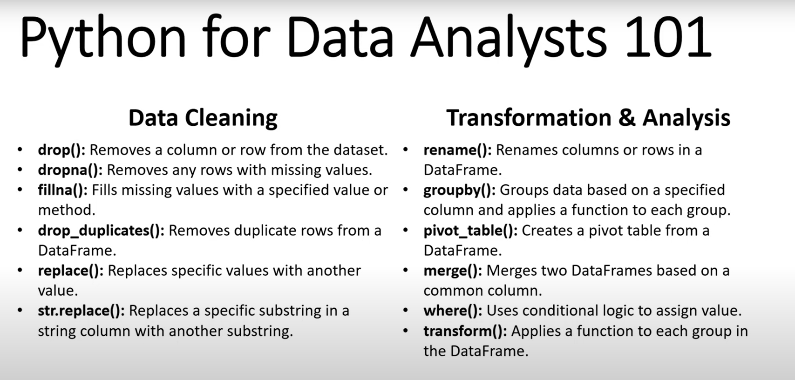

# Loan Portfolio Analysis and Visualization of Bank X for December 2020
 

Keyword chính: 
Mình đang làm là data cleaning chứ không phải là preprocessing
- check duplicated -> loại bỏ duplicated
- changing columns names

cách dùng lệnh group by, pivot table
 -----------------
I. Các bước để Data Preprocessing
S1: Import Neccesssary Library
S2: Read Dataset
- head(), tail()
S3: Sanity check of data
- shape(), info()
- isnull(), Percent of null in each columns
- duplicated()
- garbage value is always in the dtypes of object: đại loại là viết vòng for để kiểm tra các giá trị trong object, nếu sai thì sửa, ngoài ra hỗ trợ phân nhóm. 
S4: EDA
- descriptive statistics ( number, object): df.describe(inclue = "object")
- histogram to understand the data distribution: dùng hàm for,
S5: Missing Value Treatment
S6: Outliers treatment
S7: Duplicated & garbage value treatment
S8: Normalizaiton
S9: Encoding Data
II. Note ETL bằng Python
- Viết hàm để tìm ra điểm chung giữa 2 df
- viết hàm để merge

0. Rename Column-Date/Time Formatting - Define Indexing/Primary Key
1. Data Type Conversion
2. Fill Null/ duplicated
3. Check data consistency
4. Handle Outliers
5. Text Cleaning

